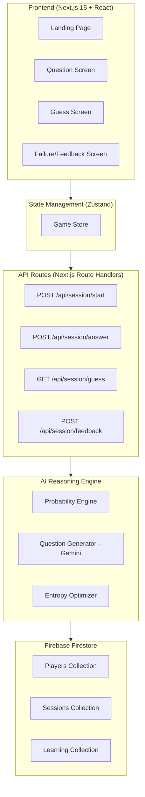

# IPLMind — Implementation Plan

## Architecture Overview



## Build Phases

### Phase 1: Project Setup
- [x] Initialize Next.js 15 with App Router
- [x] Install dependencies (Tailwind, Framer Motion, Zustand, Firebase, Gemini SDK)
- [x] Configure project structure

### Phase 2: Dataset & Database
- [x] Create 500+ IPL player dataset
- [x] Define Firestore schema
- [x] Seed script for database

### Phase 3: AI Engine
- [x] Probability engine (Bayesian updating)
- [x] Entropy-based question selection
- [x] Gemini-powered question generation
- [x] Candidate filtering

### Phase 4: API Routes
- [x] Session management
- [x] Answer processing
- [x] Guess logic
- [x] Feedback & learning

### Phase 5: Frontend
- [x] Landing page
- [x] Question screen
- [x] Guess screen
- [x] Failure/feedback screen
- [x] Zustand store
- [x] Animations & polish

### Phase 6: Integration & Polish
- [x] Firebase integration
- [x] End-to-end testing
- [x] Responsive design
- [x] Production optimization

## Folder Structure

```
d:\IPLMind\
├── src/
│   ├── app/
│   │   ├── layout.js
│   │   ├── page.js              # Landing page
│   │   ├── play/
│   │   │   └── page.js          # Question screen
│   │   ├── guess/
│   │   │   └── page.js          # Final guess screen
│   │   ├── feedback/
│   │   │   └── page.js          # Failure/feedback screen
│   │   ├── api/
│   │   │   └── session/
│   │   │       ├── start/route.js
│   │   │       ├── answer/route.js
│   │   │       ├── guess/route.js
│   │   │       └── feedback/route.js
│   │   └── globals.css
│   ├── components/
│   │   ├── landing/
│   │   ├── game/
│   │   └── ui/
│   ├── store/
│   │   └── gameStore.js
│   ├── lib/
│   │   ├── firebase.js
│   │   ├── gemini.js
│   │   ├── probabilityEngine.js
│   │   ├── questionEngine.js
│   │   └── sessionManager.js
│   └── data/
│       └── players.js
├── public/
├── .env.local
├── next.config.mjs
├── tailwind.config.js
├── package.json
└── README.md
```
